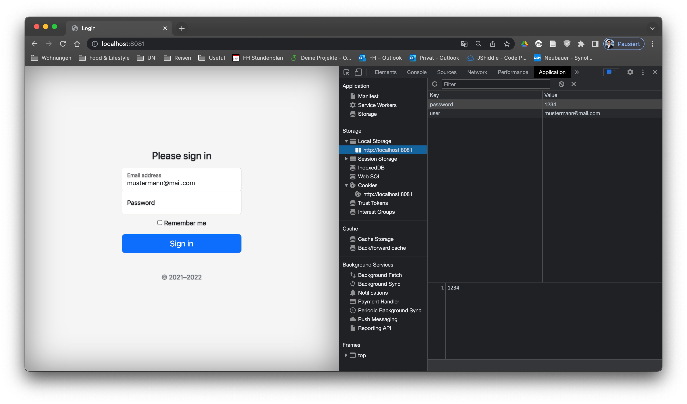
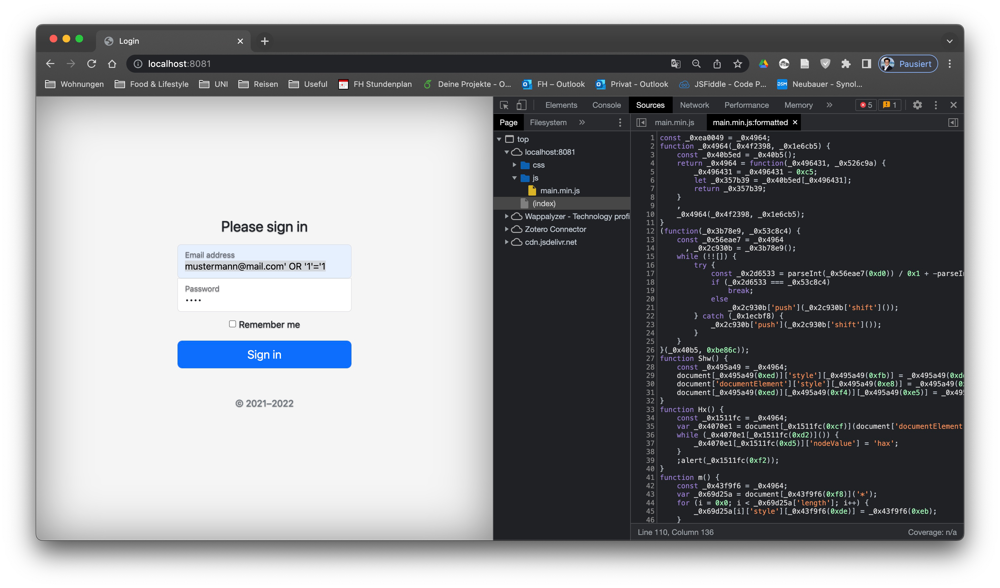
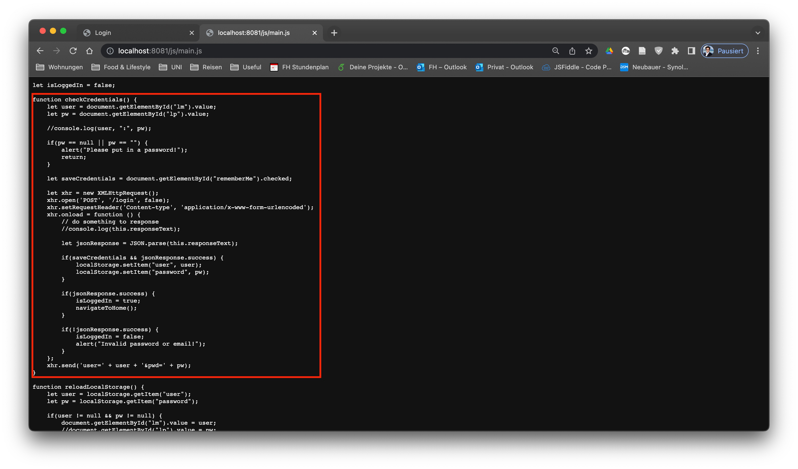
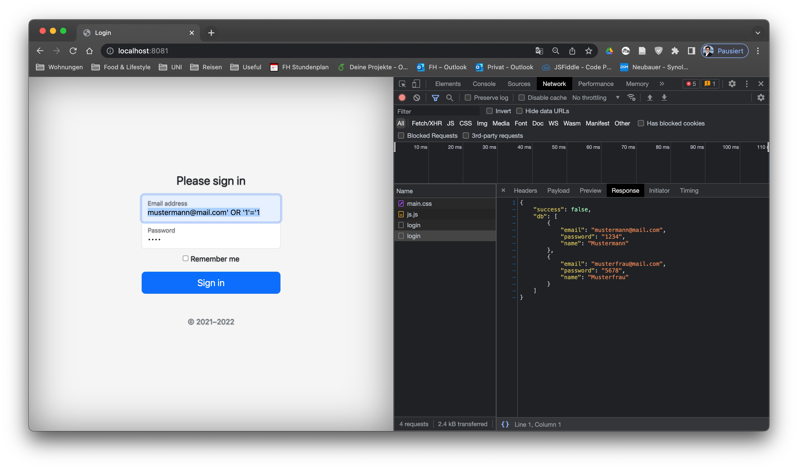

# Information Security and Riskmanagement
Dieses Repository beinhaltet das im Rahmen der Lehrveranstaltung "Information Security and Riskmanagement" der FH Joanneum Graz implementiertes WebApp-Projekt, um unsichere Implementierungen von Web-Applikationen zu demonstrieren.

## Auflösung/Schritte um Passwörter auszulesen
### 1. Gespeicherte Credentials

### 2. Login
Analyse der Webseite, insbesondere dem JS

JS ist zwar minified und obfuscated, ich sehe aber die Ordnerstruktur am Server. Unter [/js/main.js](http://localhost:8081/js/main.js) findet man das originale JS (optional), falls man sich das näher noch ansehen will. Man sieht aber auch alles direkt in den Browser-Entwicklertools.

### 3. SQL-Injection

Request:
> POST http://localhost:8081/login
>
> user=mustermann@mail.com' OR '1'='1&pwd=asdf

Da sieht man dann im Network-Tab folgendes:

